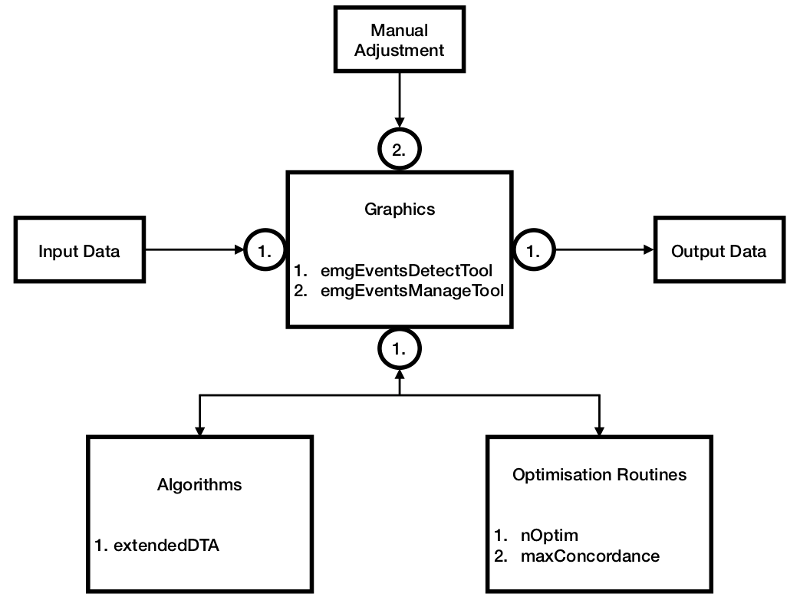
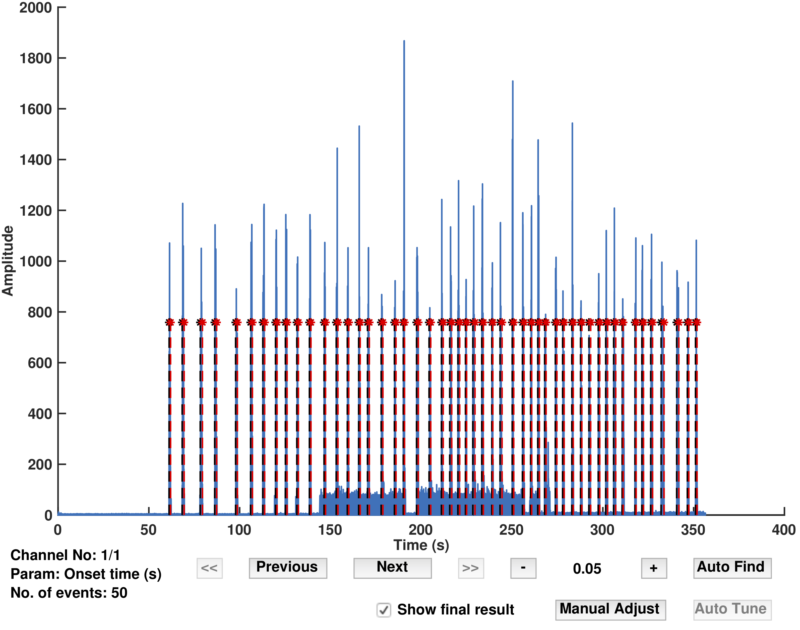
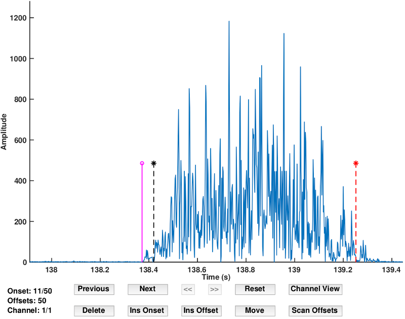

# emgGO

emgGO (electromyography, graphics and optimisation) is a toolbox for offline muscle activity onset/offset detection in multi-channel EMG data.

## Compatibility
Currently, emgGO is being developed on macOS Mojave, MATLAB 2017b.

## Installation
1. Clone the git repository using git. Or, download a compressed copy [here](https://codeload.github.com/GallVp/emgGO/zip/master).
```
$ git clone https://github.com/GallVp/emgGO
```
2. From MATLAB file explorer, enter the emgGO folder by double clicking it. Follow the [tutorials](https://github.com/GallVp/emgGO/tree/master/docs) to experiment with the sample data.

## Tutorials
Detailed tutorials are available [here](https://github.com/GallVp/emgGO/tree/master/docs).

## Overview
emgGO is divided into three modules, (a) detection algorithms, (b) optimisation routines, and (c) graphics tools. This modular design is enforced with strictly defined protocols of information exchange across these modules. By following the defined protocols, new functionality can be added to a module without changing any code in the other modules. The modular structure along with their inter-connection is shown in below figure.

<p align="center">
<hr>
<em>Fig 1. The different modules of emgGO along with their inter-connections.</em>
</p>

### Algorithms and Optimisation
Currently, emgGo has one detection algorithm and two optimisation routines. These are explained in the above cited publication. extendedDTA is an extended version of the double thresholding algorithm.

Using the *nOptim* technique, the expected number of onsets/offsets can be automatically detected in the data. These onsets/offsets can be scrolled through and individually adjusted using GUI tools with keyboard shortcuts or the mouse pointer.

### Graphics Tools
emgGO has two graphics tools, (1.) *emgEventsDetectTool and* (2.) *emgEventsManageTool*. *emgEventsDetectTool* displays the loaded data and automatically detects the onsets/offsets using the selected algorithm. It can be used to switch between channels, manually tune the detection algorithm with the ability to visually check the results of each step of the algorithm, and automatically find the expected number of onset/offset pairs using the *nOptim* technique. Its impression is shown in the figure below.

<p align="center">
<hr>
<em>Fig 2. emgEventsDetectTool.</em>
</p>

*emgEventsManageTool* can be used to scroll through individual onsets or offets. Both keyboard shortcuts and mouse pointer can be used to insert, delete, and move each event.

<p align="center">
<hr>
<em>Fig 3. emgEventsManageTool.</em>
</p>

## Third Party Libraries
emgGO uses following third party libraries. The licenses for these libraries can be found next to source files in their respective libs/thirdpartlib folders.
1. `energyop` Copyright (c) 2014, Hooman Sedghamiz. Source is available [here](https://au.mathworks.com/matlabcentral/fileexchange/45406-teager-keiser-energy-operator-vectorized).