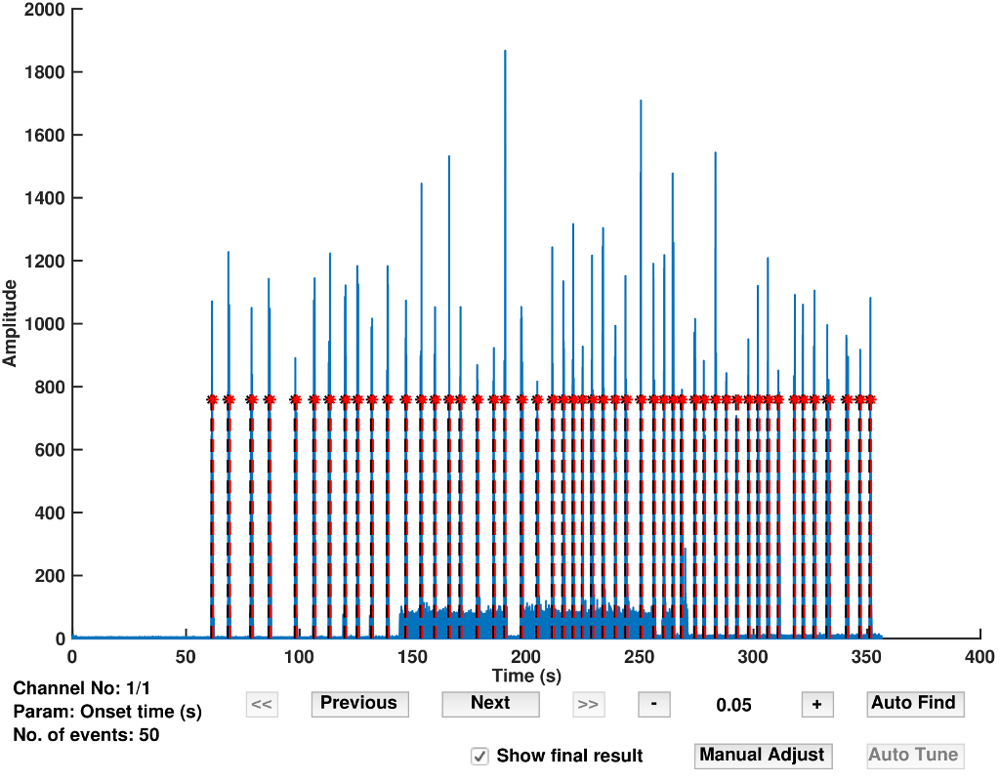

# emgGO

emgGO (electromyography, graphics and optimisation) is a toolbox for offline muscle activity onset/offset detection in multi-channel EMG data.

<p align="center">
<hr>
<em>Fig 1. The GUI tools of emgGo which allow interactive processing of data.</em>
</p>

## Related Publications

1. Optimal Automatic Detection of Muscle Activation Intervals, *Journal of Electromyography and Kinesiology*, doi: [10.1016/j.jelekin.2019.06.010](https://doi.org/10.1016/j.jelekin.2019.06.010)

## Compatibility

Currently emgGO is being developed on macOS Mojave, MATLAB 2017b.

## Installation

1. Clone the git repository using git. Or, download a compressed copy [here](https://codeload.github.com/GallVp/emgGO/zip/master).

```
$ git clone https://github.com/GallVp/emgGO
```

2. From MATLAB file explorer, enter the emgGO folder by double clicking it. Follow the [tutorials](https://github.com/GallVp/emgGO/tree/master/docs) to experiment with the sample data.

## Tutorials

<ul>
    <li>
        <a href="https://github.com/GallVp/emgGO/tree/master/docs/README.md">emgGO: An Overview</a>
    </li>
    <li>
        <a href="https://github.com/GallVp/emgGO/tree/master/docs/importTutorial.md">How to Import Data in emgGO?</a>
    </li>
    <li>
        <a href="https://github.com/GallVp/emgGO/tree/master/docs/detectionTutorial.md">How to Detect Onsets/Offsets?</a>
    </li>
    <li>
        <a href="https://github.com/GallVp/emgGO/tree/master/docs/edtaExplained.md">The Extended Double Thresholding Algorithm</a>
    </li>
</ul>

## Third Party Libraries

emgGO uses following third party libraries. The licenses for these libraries can be found next to source files in their respective libs/thirdpartlib folders.

1. `energyop` Copyright (c) 2014, Hooman Sedghamiz. Source is available [here](https://au.mathworks.com/matlabcentral/fileexchange/45406-teager-keiser-energy-operator-vectorized).