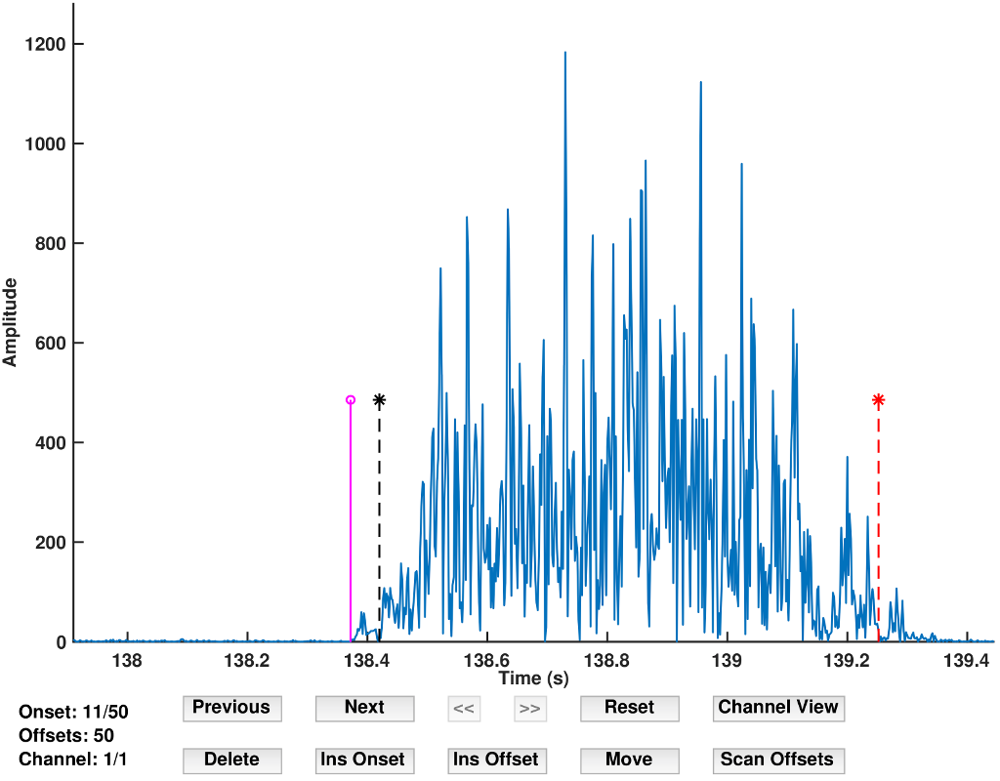

# emgGO: An Overview

## Tutorials:

<ul>
    <li>
        <a href="importTutorial.md">How to Import Data in emgGO?</a>
    </li>
    <li>
        <a href="detectionTutorial.md">How to Detect Onsets/Offsets?</a>
    </li>
    <li>
        <a href="pipelineTutorial.md">How to Create a Processing Pipeline?</a>
    </li>
    <li>
        <a href="edtaExplained.md">The Extended Double Thresholding Algorithm</a>
    </li>
</ul>

## Overview of emgGO

emgGO is divided into three modules, (a) detection algorithms, (b) optimisation routines and (c) graphics tools. This modular design is enforced with strictly defined protocols of information exchange across these modules. By following the defined protocols, new functionality can be added to a module without changing any code in the other modules. The modular structure along with their inter-connection is shown in below figure.

<em>Fig 1. The different modules of emgGO along with their inter-connections.</em>

### Algorithms and Optimisation

Currently, emgGo has one detection algorithm and two optimisation routines. These are explained in the above cited publication. extendedDTA is an extended version of the double thresholding algorithm.

Using the *nOptim* optimisation technique, the estimated number of onsets/offsets can be automatically detected in the data. These onsets/offsets can be scrolled through and individually adjusted using GUI tools with keyboard shortcuts or the mouse pointer.

### Graphics Tools

emgGO has two graphics tools, (1.) *emgEventsDetectTool* and (2.) *emgEventsManageTool*. *emgEventsDetectTool* displays the loaded data and automatically detects the onsets/offsets using the selected algorithm. It can be used to switch between channels, manually tune the detection algorithm with the ability to visually check the results of each operation of the algorithm, and automatically find the estimated number of onset/offset pairs using the *nOptim* technique. Its impression is shown in the figure below.

<em>Fig 2. emgEventsDetectTool.</em>

*emgEventsManageTool* can be used to scroll through individual onsets or offets. Both keyboard shortcuts and mouse pointer can be used to insert, delete, and move each event.

<em>Fig 3. emgEventsManageTool.</em>

