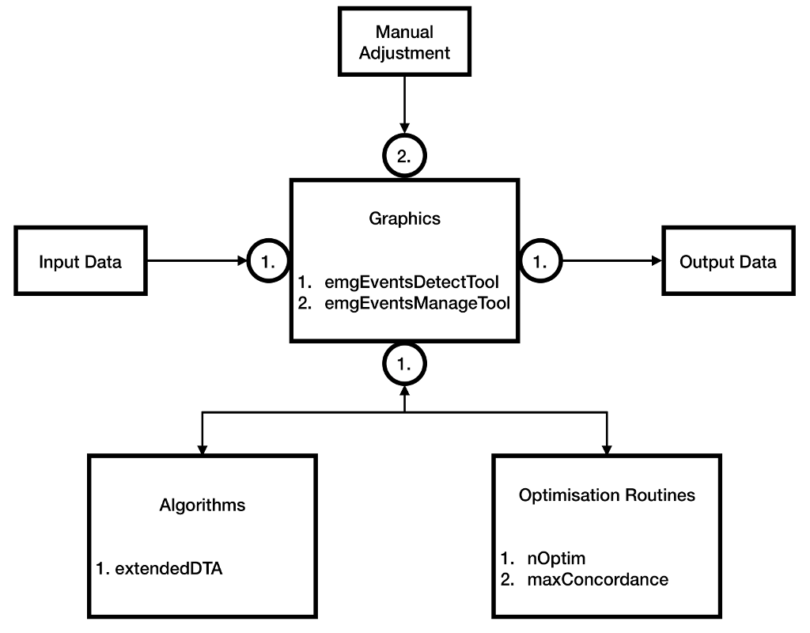

# How to Use emgGO?

## Contents:
<ul>
    <li>
        <a href="importTutorial.md">How to import data in emgGO?</a>
    </li>
    <li>
        <a href="detectionTutorial.md">How to detect onsets/offsets?</a>
    </li>
</ul>

## Compatibility

Currently emgGO is being developed on macOS Mojave, MATLAB 2017b.

## Installation

1. Clone the git repository using git. Or, download a compressed copy [here](https://codeload.github.com/GallVp/emgGO/zip/master).

```
$ git clone https://github.com/GallVp/emgGO
```

2. From MATLAB file explorer, enter the emgGO folder by double clicking it. Follow the [tutorials](https://github.com/GallVp/emgGO/tree/master/docs) to experiment with the sample data.

## Overview of emgGO

emgGO is divided into three modules, (a) detection algorithms, (b) optimisation routines and (c) graphics tools. This modular design is enforced with strictly defined protocols of information exchange across these modules. By following the defined protocols, new functionality can be added to a module without changing any code in the other modules. The modular structure along with their inter-connection is shown in below figure.

<p align="center">
<hr>
<em>Fig 1. The different modules of emgGO along with their inter-connections.</em>
</p>

### Algorithms and Optimisation

Currently, emgGo has one detection algorithm and two optimisation routines. These are explained in the above cited publication. extendedDTA is an extended version of the double thresholding algorithm.

Using the *nOptim* optimisation technique, the estimated number of onsets/offsets can be automatically detected in the data. These onsets/offsets can be scrolled through and individually adjusted using GUI tools with keyboard shortcuts or the mouse pointer.

### Graphics Tools

emgGO has two graphics tools, (1.) *emgEventsDetectTool* and (2.) *emgEventsManageTool*. *emgEventsDetectTool* displays the loaded data and automatically detects the onsets/offsets using the selected algorithm. It can be used to switch between channels, manually tune the detection algorithm with the ability to visually check the results of each operation of the algorithm, and automatically find the estimated number of onset/offset pairs using the *nOptim* technique. Its impression is shown in the figure below.

<p align="center">
<hr>
<em>Fig 2. emgEventsDetectTool.</em>
</p>

*emgEventsManageTool* can be used to scroll through individual onsets or offets. Both keyboard shortcuts and mouse pointer can be used to insert, delete, and move each event.

<p align="center">
<hr>
<em>Fig 3. emgEventsManageTool.</em>
</p>

#### Keyboard Shortcuts for emgEventsManageTool
<table class="tut-table">
        <tr>
            <th>Key</th>
            <th>Description</th>
        </tr>
        <tr>
            <td>&larr;, &rarr;</td>
            <td>Scroll through the onsets/offsets. Once an event is selected, these keys move the selection highlighter.</td>
        </tr>
        <tr>
            <td>&uarr;, &darr;</td>
            <td>Zoom in/out along the verticle direction.</td>
        </tr>
        <tr>
            <td>., /</td>
            <td>Zoom in/out along the horizontal direction.</td>
        </tr>
        <tr>
            <td>spacebar</td>
            <td>Select current onset/offset. Once an event is selected, it moves the event to the current poition of the selection highlighter.</td>
        </tr>
        <tr>
            <td>i, I</td>
            <td>Insert onset at the current poition of the selection highlighter.</td>
        </tr>
        <tr>
            <td>o, O</td>
            <td>Insert offset at the current poition of the selection highlighter.</td>
        </tr>
        <tr>
            <td>d, D</td>
            <td>Delete currently selected onset/offset.</td>
        </tr>
        <tr>
            <td>q, e</td>
            <td>Fast move selection highlighter.</td>
        </tr>
        <tr>
            <td>Esc</td>
            <td>Remove the selection highlighter.</td>
        </tr>
        <tr>
            <td>left-click</td>
            <td>Insert selection highlighter at current position of the mouse. Only works if emg plot or onset/offset is clicked.</td>
        </tr>
</table>
    
## Known Issues
Following problems are known and are being fixed.
<ol>
    <li>Keyboard shortcuts do not work after pressing a button in emgEventsManageTool.</li>
    <p>The solution is to click on the gray area in the window after pressing a button. The cause of the problem is that MATLAB does not return the focus back to the main window once a button is pressed. Hopefully, it will be fixed in a future version of MATLAB.</p>
</ol>