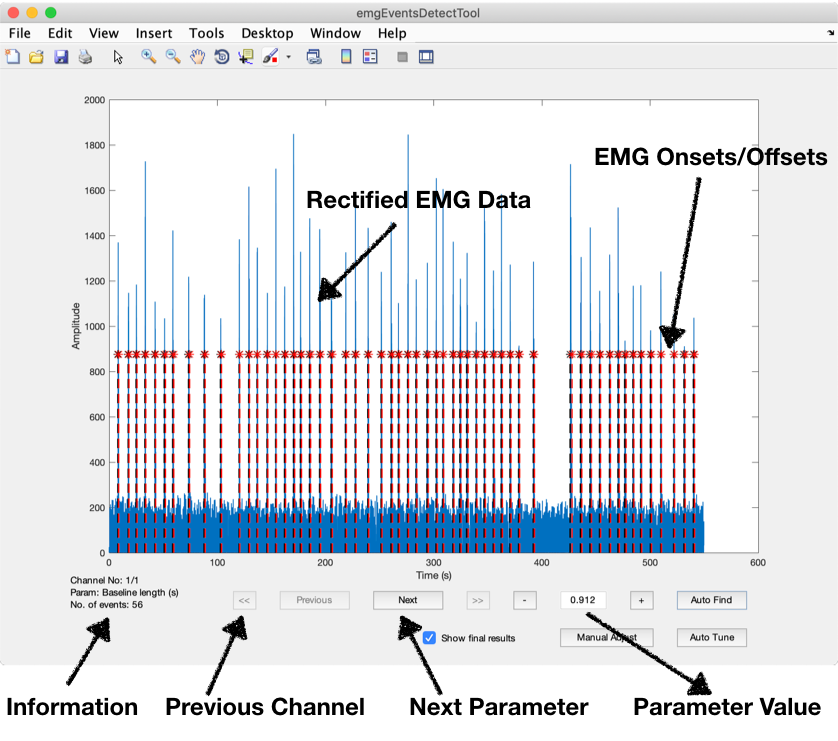
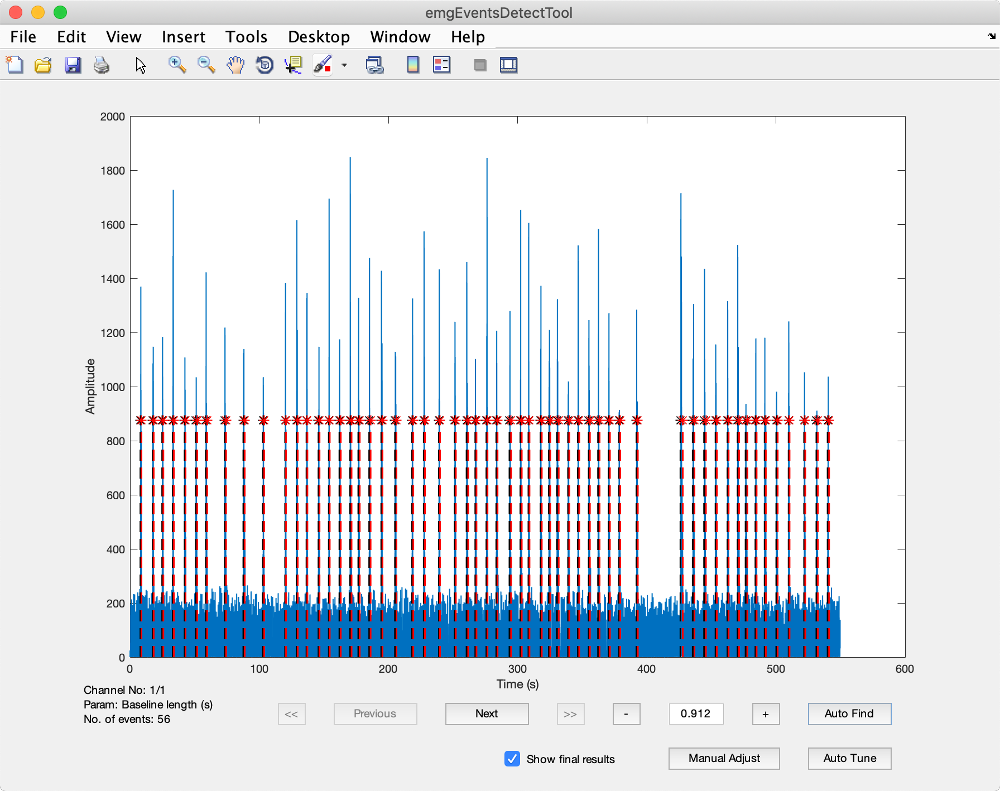
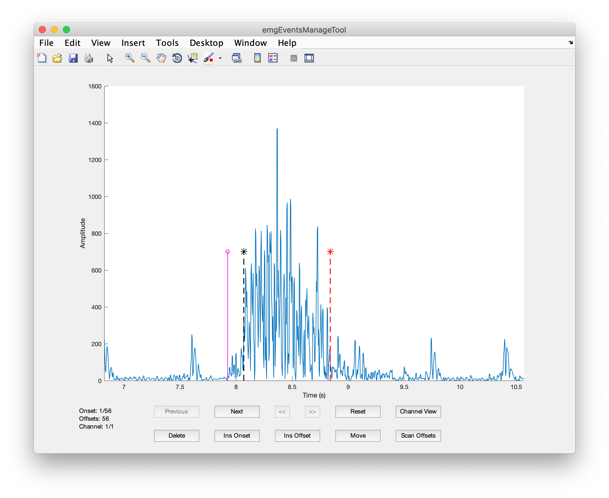

# How to detect onsets/offsets?

<ul>
    <li>
        <a href="README.md">How to Use emgGO?</a>
    </li>
    <li>
        <a href="importTutorial.md">How to import data in emgGO?</a>
    </li>
</ul>

<a href="importTutorial.md">Import data</a> and run <code class="mcode">[resultEmg, optimalParams] = emgEventsDetectTool(EMG);</code> function.

<em>Fig 1. Data loaded in the <code>emgEventsDetectTool</code>.</em>

The EMG signal contains 56 muscle activations. However, in the bottom left corner of the tool, it shows that the algorithm has detected 55 onset/offset pairs. Furthermore, some of the activations have been detected incorrectly. The algorithm parameters can be manually optimised with live preview by increasing (+) or decreasing (-) its value. However, this manual tuning can take a long time. The following section describes how to automatically find correct number (56) of onset/offset pairs.

## Auto Find Operation

To automatically find correct number of onset/offset pairs, hit 'Auto Find' button. Enter the number of onset/offset pairs to find and click 'OK'. The *nOptim* optimizer runs in the background and it's progress can be viewed in MATLAB command window. The results are shown below. Now the algorithm has detected the desired number of onsets and offsets.

<em>Fig 2. Results of Auto Find operation.</em>

## Manual Adjust Operation

To manually adjust the onsets/offsets, hit 'manual Adjust' button. This brings up the `emgEventsManageTool`. This tool can be used to insert, delete and move individual onsets/offsets.

<em>Fig 3. <code>eventsManageTool</code> showing a single muscle activation interval with the onset, the offset and the selection highlighter.</em>

 An onset/offset can be deleted by selecting it by clicking on it and then hitting the 'Delete' button. To insert an onset/offset at a particular point, click that point and it will show a pink colored highlighted 'event' as shown below. 'Insert Onset' or 'Insert Offset' button can then be used to insert an onset or an offset respectively.

However, this method of select, delete and select, insert can be very slow. An efficient method for adjusting onsets is described in following steps. First, all detected onsets are adjusted. Then, missing onsets are inserted manually.
<ul>
        <li>
            Scroll through the onsets using 'leftarrow' and 'rightarrow' keys.
        </li>
        <li>
            Zoom in x-axis using '/' key and zoom out using '.' key. Zoom in and out y-axis using 'uparrow' and 'downarrow' keys respectively.
        </li>
        <li>
            Select the currently shown onset by hitting 'spacebar'.
        </li>
        <li>
            Move the selected onset by using 'leftarrow' and 'rightarrow' keys. To move the onset at faster speed use 'q' and 'e' keys.
        </li>
        <li>
            To finialise the position of the selected onset hit 'spacebar'. Or hit 'Esc' to unselect the onset without changing it position.
        </li>
        <li>
            To delete the selected onset, hit 'd'. Please note, if you have deleted an onset without inserting an other one in its place you have to delete the corresponding offset. Otherwise, some of the features explained later in this tutorial won't work.
        </li>
        <li>
            Once all detected onsets have been adjusted, hit 'Channel View' button to open window which show a simplified plot of emg data with adjusted onsets and offsets. Find the time points where the onsets/offsets are missing. Go to the 'emgEventsManageTool' and manually insert onsets/offsets at those points. 'i' or 'o' keys can be used to insert onset or offset at the highlighted point.
        </li>
</ul>

Once satisfied with the results, close this tool to go back to `emgEventsDetectTool`. The process of detecting and adjusting onsets/offsets is complete and the tool can be closed with results returned to MATLAB workspace.

However, before closing the `emgEventsDetectTool`, another operation can be applied to find optimal parameters from adjusted onsets/offsets. These parameters can then be used as the starting point for similar datasets. To do that, simply click 'Auto Tune' button. An optimizer will run in the background and optimize the parameters in light of new information from the adjustment of onsets/offsets by the user.