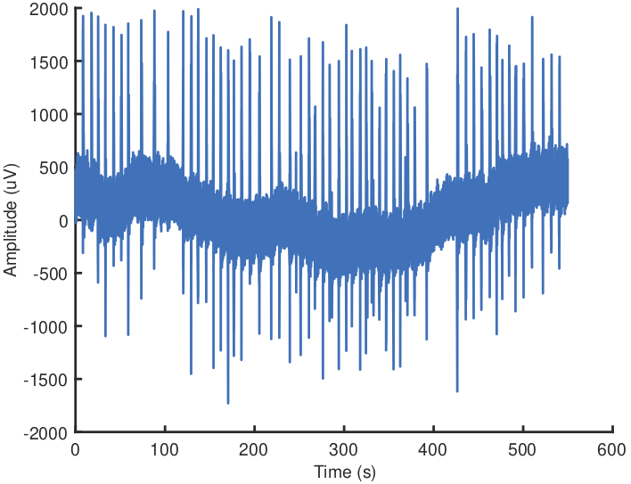
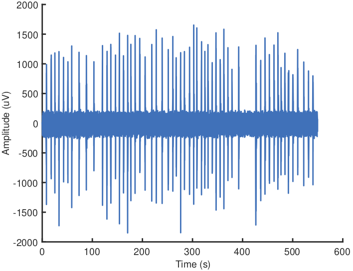
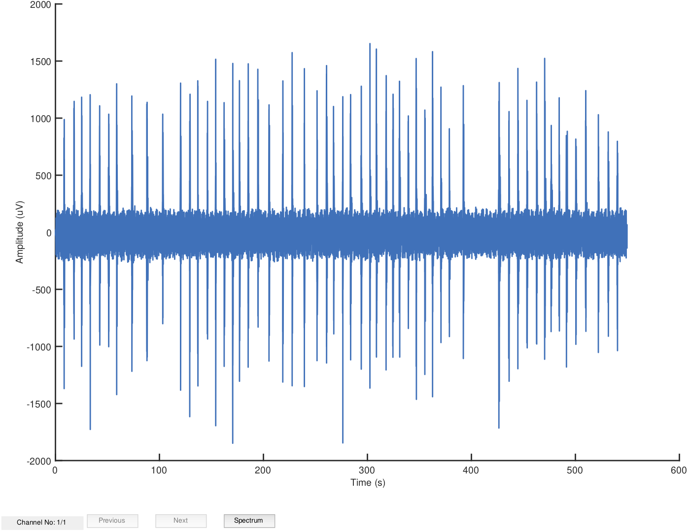
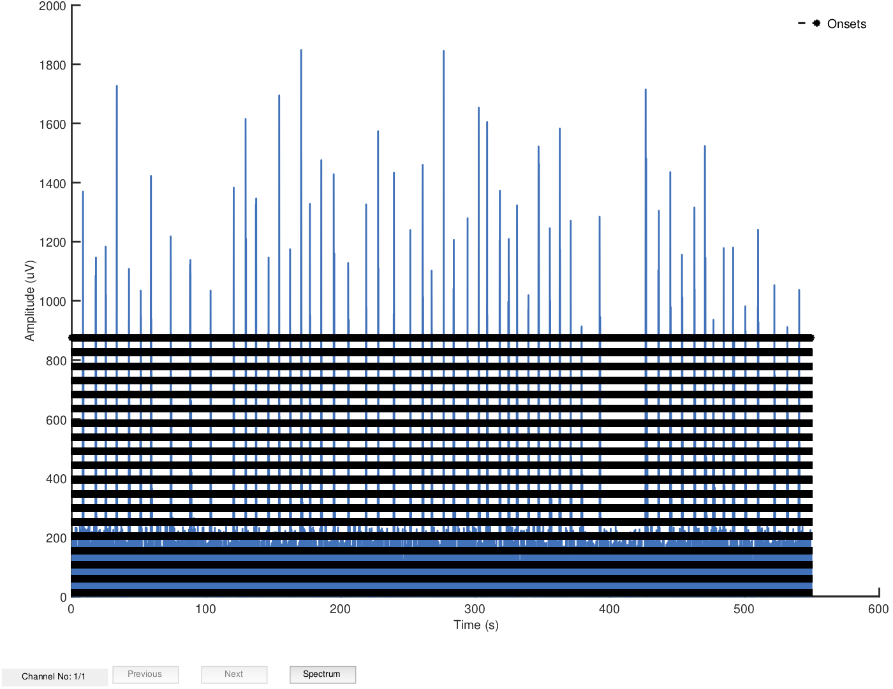
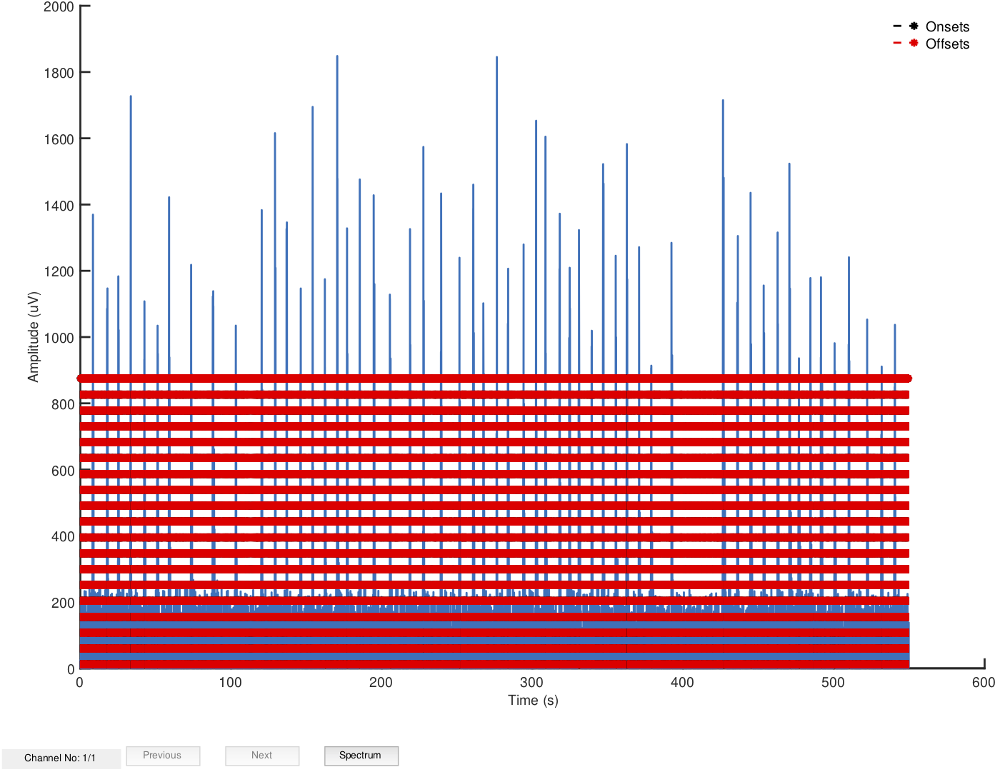
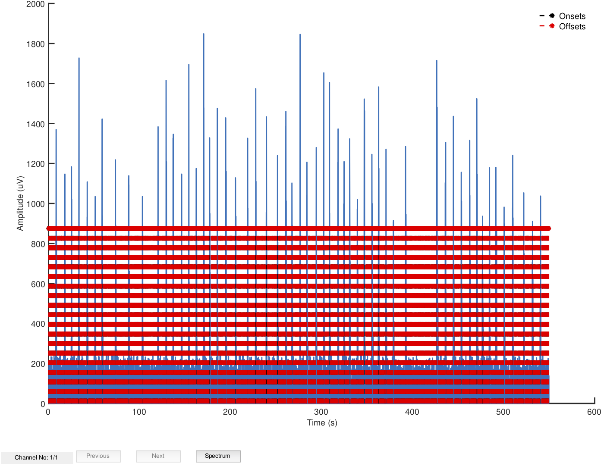
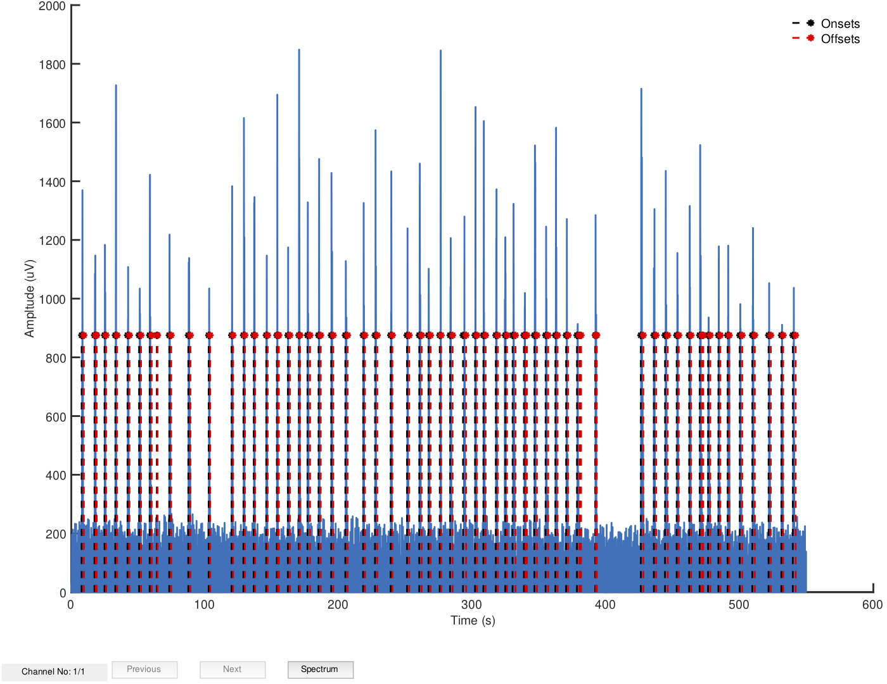
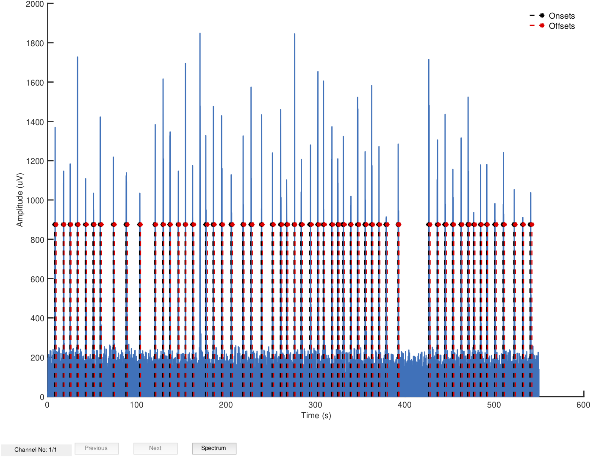

# The Extended Double Thresholding Algorithm

## Tutorials:

<ul>
    <li>
        <a href="README.md">emgGO: An Overview</a>
    </li>
    <li>
        <a href="importTutorial.md">How to Import Data in emgGO?</a>
    </li>
    <li>
        <a href="detectionTutorial.md">How to Detect Onsets/Offsets?</a>
    </li>
    <li>
        <a href="pipelineTutorial.md">How to Create a Processing Pipeline?</a>
    </li>
</ul>

## Research behind the Extended Double Thresholding Algorithm (eDTA)

The extended double thresholding algorithm is an extension of the double thresholding algorithm and is inspired by the research presented in the following publications.

1. A statistical method for the measurement of muscle activation intervals from surface myoelectric signal during gait, *IEEE Transactions on Biomedical Engineering*, doi: [10.1109/10.661154](https://doi.org/10.1109/10.661154)

2. An algorithm for detecting EMG onset/offset in trunk muscles during a reaction- stabilization test, *Journal of Back and Musculoskeletal Rehabilitation*, doi: [10.3233/BMR-150617](https://doi.org/10.3233/BMR-150617)

3. A fast and reliable technique for muscle activity detection from surface EMG signals, *IEEE Transactions on Biomedical Engineering*, doi: [10.1109/tbme.2003.808829](https://doi.org/10.1109/tbme.2003.808829)

The extended version was itself published in the following article: Optimal Automatic Detection of Muscle Activation Intervals, *Journal of Electromyography and Kinesiology*, doi: [10.1016/j.jelekin.2019.06.010](https://doi.org/10.1016/j.jelekin.2019.06.010). In the article, a step by step overview of the algorithm was presented as a set of abstract concepts, operations and justification for the operations. In the following guide, a more practical explanation is presented as a series of MATLAB functions applied to an example sEMG signal to detect muscle activation intervals.

## A Step by Step Explanation of eDTA

**Example sEMG Signal:** For this guide, a single channel sEMG signal is used. It was recorded from the tibialis anterior muscle during multiple repetitions of ballistic right foot ankle dorsiflexion. It was recorded at a rate of 250 Hz. The signal can be loaded from the *emgGO/samples/Sample Data.mat* file. The file contains a structure called *EMG* with the following variables.

```MATLAB
>> load('./samples/Sample Data.mat')
>> EMG

EMG = 

  struct with fields:

    channelData:    [137420×1 double]
             fs:    250
```

The sEMG signal can be plotted as follows with the result shown in figure 1. Note that the signal is raw, unfiltered and unrectified.

```MATLAB
>> plot((1:length(EMG.channelData)) ./ EMG.fs, EMG.channelData)
>> xlabel('Time (s)')
>> ylabel('Amplitude (uV)')
```

<p align="center">
<hr>
<em>Fig 1. Plot of the sample sEMG signal.</em>
</p>

**Signal Preprocessing:** The extended double thresholding algorithm does not filter the data itself. The choice of the appropriate filter is left to the user. The preprocessing was kept separate from the algorithm as different muscle signals may require very different preprocessing steps. Moreover, different researchers have different preferences for particular type and order of the filter. 

In emgGo toolbox, a simple preprocessing function is available. This function *emgGo/helpers/filterStream.m* applies a low-pass and a high-pass Butterworth filter at selected cut off frequencies. The order and the application of MATLAB's zero-phase command `filtfilt` can be selected.

The example sEMG signal plotted in figure 1 is filtered as follows with the result shown in figure 2. Note that the input of the *filterStream* function is the channel data and the sampling frequency, filter order equal to 2, low-pass cut off at 100 Hz, high-pass cut off at 10 Hz, and zero-phase flag equal to 1. The resultant signal is still unrectified.

```MATLAB
>> EMG.channelData = filterStream(EMG.channelData, EMG.fs, 2, 100, 10, 1);

>> plot((1:length(EMG.channelData)) ./ EMG.fs, EMG.channelData)
>> xlabel('Time (s)')
>> ylabel('Amplitude (uV)')
```

<p align="center">
<hr>
<em>Fig 2. Plot of the filtered sample sEMG signal.</em>
</p>

**The `plotEMG` function:** emgGo toolbox also a handy function for plotting the data. This function *emgGO/plotters/plotEMG* can automatically do a lot of things in the background such as assigning axis labels. The same plot as shown in figure 2 can be obtained as follows using `plotEMG` function with the result plotted in figure 3. Note the *showRectifiedEmg* flag is set to zero as by default the `plotEMG` function sets this flag to 1 and shows the rectified signal. The *yLabel* is also set to *Amplitude (uV)* as by default it is set to *Amplitude*. This function can also plot multi-channel data and has a number of additional features which we will see in action later.

```MATLAB
>> options.showRectifiedEmg = 0;
>> options.yLabel = 'Amplitude (uV)'
>> plotEMG(EMG, options)
```

<p align="center">
<hr>
<em>Fig 3. Plot of the filtered sample sEMG signal using the plotEMG function.</em>
</p>

### List of eDTA Operations

At this stage the signal can be passed to the extended double thresholding algorithm for detection of onsets/offsets. In emgGo toolbox, the functions which implement the algorithm are given in *emgGO/algorithms/extendedDTA* folder. The main function is *emgGO/algorithms/extendedDTA/extendedDTA.m*. This function takes a single channel sEMG data, sampling frequency and a vector of algorithm parameters as described below. 

```MATLAB
function [onSets, offSets] =  extendedDTA(singleChannel, fs, optionsVector)
%   Inputs:
%   singleChannel: A vector with single channel sEMG data.
%   fs:            The sampling frequency of the input signal.
%   optionsVector: A vector of algorithm parameters. The parameters are
%                  specified in the following order.
%                  1. Baseline length (seconds), Lb
%                  2. Stds. above baseline (number), Nsd
%                  3. Baseline rank (number), Kbth
%                  4. On time (seconds), Ton
%                  5. Off time (seconds), Toff
%                  6. Min. active time (seconds), Ts
%                  7. Non-typical stds. (number), Nnt
%                  8. Join events within (seconds), Tj
%
%   Outputs:
%   onSets:        A vector of muscle activation onsets represented as
%                  indices of the singleChannel.
%   offSets:       A vector of muscle activation offsets represented as
%                  indices of the singleChannel.
```

Let's assume that the following set of parameters is a good selection for the sample sEMG signal plotted in figure 3. The selection of these parameters is based on intuition, past experiences and literature reading. These parameters have to be changed frequently. To get rid of this problem, *nOptim* method provided with the emgGo toolbox can be used. For details, see  <a href="detectionTutorial.md">How to Detect Onsets/Offsets?</a>. Here, in order to explain the extended double thresholding algorithm, we have to select a specific set of parameters.

```MATLAB
>> optionsVector = [0.1, 1, 1, 0.05, 0.05, 0.5, 2, 0];
```

The first thing that the `extendedDAT` function does is the priming of the algorithm parameters. This is done to make sure that the user or an optimisation routine has not misspecified the parameters as this may lead to error. This is done as follows.

```MATLAB
>> optionsVector    = round(optionsVector .* EMG.fs) ./ EMG.fs;
>> optionsVector(2) = round(optionsVector(2));
>> optionsVector(3) = round(optionsVector(3));
>> optionsVector(7) = round(optionsVector(7));
```

The following list of operations are applied to the sEMG signal to detect onsets/offsets. The operations are presented as MATLAB functions.

#### 1. Baseline detection

This operation takes the sEMG signal, baseline length (Lb) and baseline rank (kbth) as input and automatically selects a baseline segment in the signal. The function return the mean and the standard deviation calculated from the automatically selected baseline segment.

```MATLAB
>> [emgBaselineMean, emgBaselineSd] = estimateBaseline(EMG.channelData,...
    optionsVector(1) * EMG.fs, optionsVector(3));

>> emgBaselineMean

emgBaselineMean =

    2.1090

>> emgBaselineSd

emgBaselineSd =

    1.7460
```

Internally, `estimateBaseline` achieves this by applying the following key operations. 
The rest of the code inside `estimateBaseline` is there to make sure that if things go wrong, it does not crash and outputs something sensible that we can handle in the subsequent operations. Note that the parameters are calculated from the rectified signal using MATLAB's `abs` function.

```MATLAB
% Take the moving average of the signal
movingAverage = movmean(abs(inputSignal), baselineLength, 'Endpoints', 'discard');
% Create a rank order of the moving averages
[~, IA, ~] = uniquetol(movingAverage, UNIQUE_TOL);

% Select the interval of the baseline segment from the input signal
baselineInterval = startSampleNo - floor(baselineLength/2) + 1 : startSampleNo + floor(baselineLength/2);

% Compute baseline mean and standard deviation
baselineSegment         = inputSignal(baselineInterval);
baselineMean            = mean(abs(baselineSegment));
baselineStd             = std(abs(baselineSegment));
```

#### 2. First threshold using baseline parameters

Using the number of baseline standard deviations (Nsd) parameter the algorithm marks all the samples as 1 which are `Nsd` standard deviations above the baseline mean. Note that the operation is applied to the rectified signal.

```MATLAB
>> aboveBaselineEvents = abs(EMG.channelData) > emgBaselineMean + optionsVector(2) * emgBaselineSd;

% Plotting the results
>> options.showRectifiedEmg    = 1;
>> options.yLabel              = 'Amplitude (uV)'
>> EMG.events.onSets           = aboveBaselineEvents;
>> plotEMG(EMG, options)
```

<p align="center">
<hr>
<em>Fig 4. Plot of the sample sEMG signal with the samples which are above baseline mean and Nsd number of baseline standard deviation marked as onsets.</em>
</p>

#### 3. Second threshold using on time
The input of this operation is the `aboveBaselineEvents` vector. It consists of trains of 1's and 0's. 1's represent the signal samples which are `Nsd` standard deviations above the baseline mean.

This operation takes these trains of 1's and only allow a train which lasts for at least `Ton` seconds. The first 1 of each train is marked as an onset and the last 1 is marked as an offset. The indices of these 1's are separated into two vectors: `onSets` for indices of onsets and `offSets` for indices of offsets. The result of this operation can be obtained and plotted as follows.

```MATLAB
>> [onSets, offSets] = consecEvents(aboveBaselineEvents, optionsVector(4) * EMG.fs);

% Plotting the results
>> options.showRectifiedEmg    = 1;
>> options.yLabel              = 'Amplitude (uV)'
>> EMG.events.onSets           = onSets;
>> EMG.events.offSets          = offSets;
>> plotEMG(EMG, options)
```

<p align="center">
<hr>
<em>Fig 5. Plot of the sample sEMG signal along with onsets and offsets resulting from the second threshold using on time operation.</em>
</p>

The internal implementation of this operation is vectorised and uses a first order difference operation to find the beginning and ending of each train of 1's. MATLAB's `diff` and `find` functions are used for this purpose.

#### 4. Third threshold using off time

The input of this operation is the onset and offset index vectors from the previous operation. All the onset/offset pairs which are less than off time `Toff` seconds apart are joined together to make a single onset/offset pair. Thus, this operation makes sure that an offset is only considered a true offset if it is not followed by an onset within `Toff` seconds.

The output of this operation is shown in figure 6. The output has a larger number of false positive onset/offset pairs. This is perhaps due to the fact that the sample sEMG signal has a large electrocardiogram (EKG) artefact. Moreover, the selected `Ton` and `Toff` parameter values are very small (50 milliseconds) to keep the algorithm as sensitive as possible.

```MATLAB
>> [onSets, offSets] = pruneConsecEvents(onSets, offSets, optionsVector(5) * EMG.fs);

% Plotting the results
>> options.showRectifiedEmg    = 1;
>> options.yLabel              = 'Amplitude (uV)'
>> EMG.events.onSets           = onSets;
>> EMG.events.offSets          = offSets;
>> plotEMG(EMG, options)
```

<p align="center">
<hr>
<em>Fig 6. Plot of the sample sEMG signal along with onsets and offsets resulting from the third threshold using off time operation.</em>
</p>

#### 5. Prune short events

This operation removes most of the false positives by removing all the onset/offset pairs which represent intervals shorter than `Ts` seconds. Here, its value is set to 500 milliseconds. The output in figure 7 shows that most of the false positives have been removed.

```MATLAB
>> [onSets, offSets] = pruneShortEvents(onSets, offSets, optionsVector(6) * EMG.fs);

% Plotting the results
>> options.showRectifiedEmg    = 1;
>> options.yLabel              = 'Amplitude (uV)'
>> EMG.events.onSets           = onSets;
>> EMG.events.offSets          = offSets;
>> plotEMG(EMG, options)
```

<p align="center">
<hr>
<em>Fig 7. Plot of the sample sEMG signal along with onsets and offsets resulting from the prune short events operation.</em>
</p>

#### 6. Prune non-typical bursts

This operation removes the false positives which the previous operation failed to detect as they were longer than `Ts` seconds but do not represent an actual sEMG muscle activation interval.

This operation finds the root mean square value (RMS) of each activation interval represented by an onset/offset pair. Then it constructs a distribution of these RMS values and removes all the activation intervals which are `Nnt` standard deviations away from the mean RMS. Here, the number of standard deviations was set at 2.

```MATLAB
>> [ onSets, offSets ] = pruneNontypicalEvents(EMG.channelData,...
    onSets, offSets, optionsVector(7));

% Plotting the results
>> options.showRectifiedEmg    = 1;
>> options.yLabel              = 'Amplitude (uV)'
>> EMG.events.onSets           = onSets;
>> EMG.events.offSets          = offSets;
>> plotEMG(EMG, options)
```

<p align="center">
<hr>
<em>Fig 8. Plot of the sample sEMG signal along with onsets and offsets resulting from the prune non-typical bursts operation.</em>
</p>

Looking at the results, it seems this operation has removed the false positives which the previous operation could not. However, it has also removed an onset/offset pair which represented a legitimate muscle activation interval. This is the curse of automatic onset/offset detection. We can change the parameters of the algorithm to include the excluded activation interval but the new set of parameters may result in a new problem. This motivated the *nOptim* method , explained in <a href="detectionTutorial.md">How to Detect Onsets/Offsets?</a> tutorial, which automatically selects the algorithm parameters and the only input required from the user is the number of activation bursts.

#### 7. Join movement components

This operation is designed for situations when there are multiple discrete bursts resulting from a movement and these bursts must be represented by a single activation interval. In this case, this operation is not applied as the corresponding parameter (`Tj`) is set to 0. The algorithm only applies this operation if `Tj` is non-zero.

```MATLAB
if(optionsVector(8) > 0)
    [onSets, offSets] = joinDiscreteEvents(onSets, offSets, optionsVector(8) * fs);
end
```