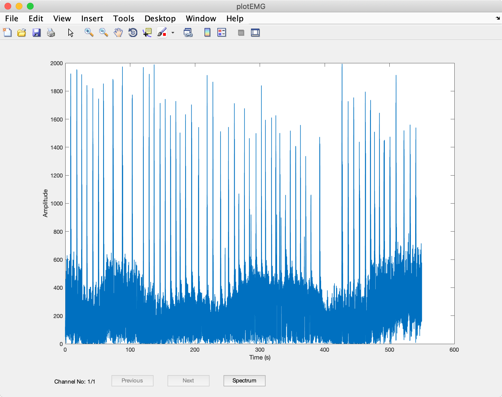
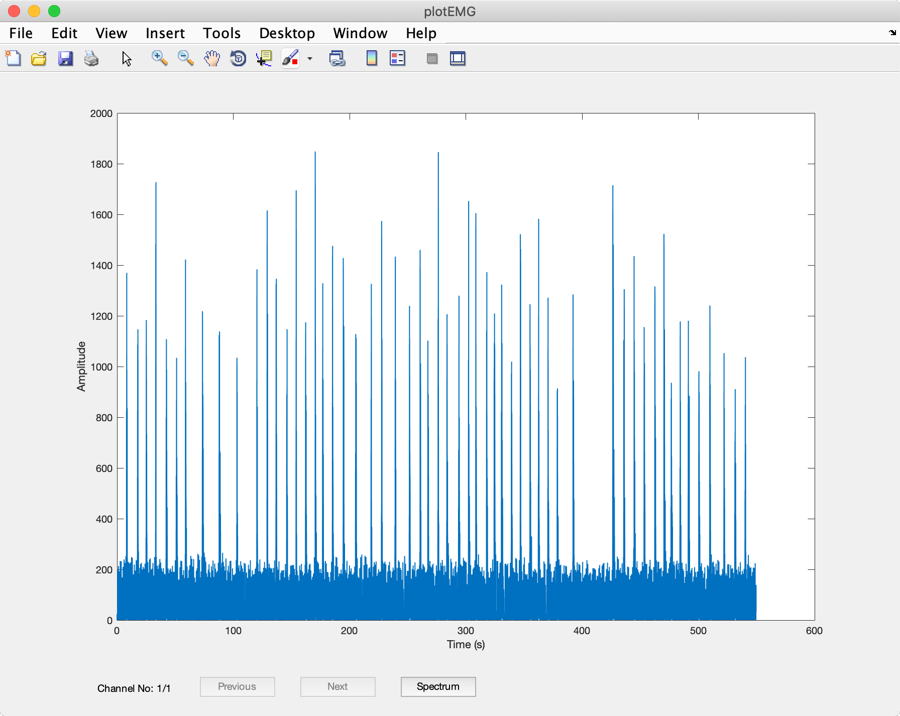

# How to import data in emgGO?

<ul>
    <li>
        <a href="README.md">How to Use emgGO?</a>
    </li>
    <li>
        <a href="detectionTutorial.md">How to detect onsets/offsets?</a>
    </li>
</ul>

Most of the functions in emgGO can be invoked by passing a single MATLAB structure as parameter. As a convention this parameter is called *EMG*. Following two fields are required to run emgGO.

<ul>
    <li>
        <code>channelData</code>: A matrix with samples across rows and channels across columns.
    </li>
    <li>
        <code>fs</code>: A scalar with sampling frequency.
    </li>
</ul>

Once the EMG structure is ready. Data can be plotted using `plotEMG(EMG);` function. And emgGO detection tool can be started using `resultEMG = emgEventsDetectTool(EMG);` function.

## Sample Data
The sample data is available in the *samples* folder. It is a single channel of surface electromyography signal recorded from the tibialis anterior muscle during multiple repetitions of ballistic dorsiflexion. It was recorded at a rate of 250 Hz.

### Loading the sample data
The sample data can be loaded by simply dragging and dropping the Sample Data.mat file in MATLAB command window. Check the workspace to ensure it has the *EMG* variable loaded.

The sample data can be plotted with `plotEMG(EMG);`. The results are shown in below figure.

<p align="center">
<hr>
<em>Fig 1. Data plotted using the  <code>plotEMG</code> function.</em>
</p>

The data is automatically rectified by the `plotEMG` function. This is the default behaviour of emgGO. Also, it does not filter the data and leaves the choice of appropriate filtering to the user. To filter the data, `filterStream` function can be used. The `filterStream` function is located in the *helpers* folder. It applies butterworth lowpass and highpass filters at provided cutoff frequencies.
```MATLAB
EMG.channelData = filterStream(EMG.channelData, EMG.fs, 2, 100, 10, 1);
```

Typing *help filterStream* in MATLAB command window shows the following.

```
filterStream(data, fs, order, fcLow, fcHigh, zeroPhase)
    Applies low and high pass butterworth filter to a stream of data.
    
    Default Parameters:
    zeroPhase   = 1; If true, filtfilt is used instead of filter.
    fcHigh      = 0.05 Hz
    fcLow       = 1 Hz
    order       = 2
```

Once filter, the data is plotted again with `plotEMG(EMG);` and the results are shown in below figure.

<p align="center">
<hr>
<em>Fig 2. Filtered data plotted using the  <code>plotEMG</code> function.</em>
</p>