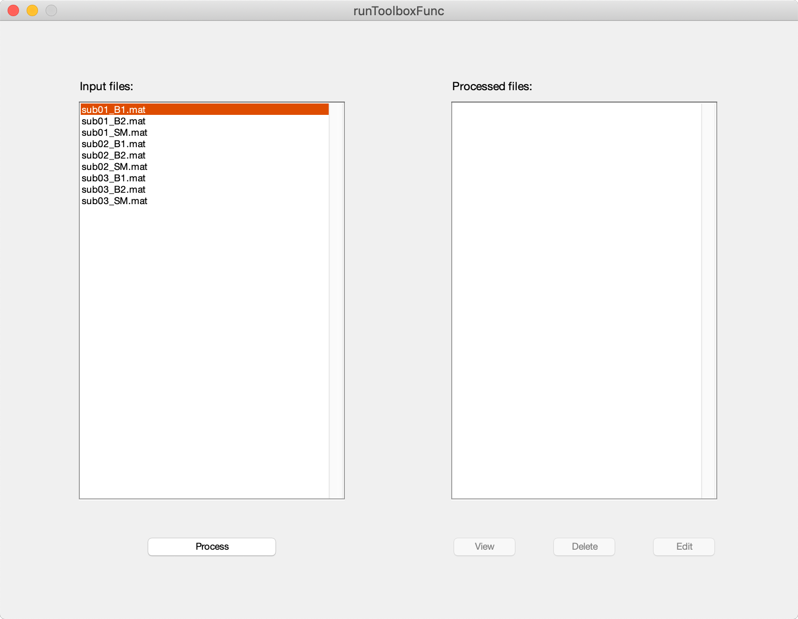

# How to Create a Processing Pipeline?

## Tutorials

<ul>
    <li>
        <a href="README.md">emgGO: An Overview</a>
    </li>
    <li>
        <a href="importTutorial.md">How to Import Data in emgGO?</a>
    </li>
    <li>
        <a href="detectionTutorial.md">How to Detect Onsets/Offsets?</a>
    </li>
    <li>
        <a href="edtaExplained.md">The Extended Double Thresholding Algorithm</a>
    </li>
</ul>

## Creating a Pipeline

A pipeline for processing files placed in a folder can be created using `emgGO/helpers/processFolder` function. This function assumes that each file inside the folder has same internal structure. This is usually the case in EMG data as the same set of channels are recorded from multiple participants across different tasks. Thus, by placing the data corresponding to each participant in a separate file with same structure and writing a function which parses the structure of the file, the processing of these files can be streamlined.

For example, consider the following case where a simple script calls the `processFolder` function with appropriate parameters. The data folder and the results folder are specified. Then a function for processing (`runToolboxFunc`) the data and editing (`editFunc`) the data are also specified. These two function are specific to the data and are able to parse the structure of the data files.

```MATLAB
%% Setup
clear
close all
clc

%% CONSTANT_PARAMETERS
DATA_FOLDER             = fullfile(pwd, 'Data');
RESULTS_FOLDER          = fullfile(pwd, 'Results');

%% Call pipeline function
processFolder(DATA_FOLDER, RESULTS_FOLDER, @runToolboxFunc, [], @editFunc);
```

Running the above script open up the *processFolder* GUI. The files in the *INPUT_FOLDER* are listed under input files section. By clicking *Process* button, `runToolboxFunc` function can be called for the selected file.

<p align="center">
<hr>
<em>Fig 1. <code>processFolder</code> GUI.</em>
</p>

Once a file has been processed, its processed copy is saved to the *RESULTS_FOLDER* and it is not listed under the input files anymore. By selecting it from the list of processed files, the `editFunc` function can be called for this file to make changes. A view function can also be programmed in a similar way. In the following two sections, example `runToolboxFunc` and `editFunc` are shown for reference. These functions are fairly detailed and show how `emgGO` GUIs are called for various channels and tasks within each file.

### An Example Process Function

```MATLAB
function outData = runToolboxFunc(inputFileName)

%% Channel info
DEEP_LEFT               = [31, 32, 39, 40];

DEEP_RIGHT              = [7, 8, 63, 64];

SUPERFICIAL_LEFT        = [25, 26, 33, 34];

SUPERFICIAL_RIGHT       = [1, 2, 57, 58];

AB_LEFT                 = 65;

AB_RIGHT                = 66;

DELTOID                 = 67;

COUGH                   = 69;

CHANNEL_INFO            = [DEEP_LEFT DEEP_RIGHT...
    SUPERFICIAL_LEFT SUPERFICIAL_RIGHT...
    AB_LEFT AB_RIGHT...
    DELTOID COUGH];

CHANNEL_INFO_PF         = [DEEP_LEFT DEEP_RIGHT...
    SUPERFICIAL_LEFT SUPERFICIAL_RIGHT];

CHANNEL_INFO_COUGH      = [DEEP_LEFT DEEP_RIGHT...
    SUPERFICIAL_LEFT SUPERFICIAL_RIGHT...
    COUGH];

CHANNEL_INFO_ABD        = [DEEP_LEFT DEEP_RIGHT...
    SUPERFICIAL_LEFT SUPERFICIAL_RIGHT...
    AB_LEFT AB_RIGHT];

CHANNEL_INFO_FF         = [DEEP_LEFT DEEP_RIGHT...
    SUPERFICIAL_LEFT SUPERFICIAL_RIGHT...
    AB_LEFT AB_RIGHT...
    DELTOID];

FS                      = 1024;

%% Prepare EMG struct
EMG.fs                  = FS;
options.subParams       = [0.2 5 1 0.004 0.1 0.5 5 0];


%% Load file data
fileData                = load(inputFileName);

%% Process PF Epochs
if(~isempty(fileData.Epoch.PF))
    pfData              = [fileData.Epoch.PF(1).Channel(CHANNEL_INFO_PF, :)...
        fileData.Epoch.PF(2).Channel(CHANNEL_INFO_PF, :)...
        fileData.Epoch.PF(3).Channel(CHANNEL_INFO_PF, :)];
    
    EMG.channelData     = pfData';
    
    pfDataProcessed     = emgEventsDetectTool(EMG, options);
else
    pfDataProcessed     = [];
end

%% Process Cough Epochs
if(~isempty(fileData.Epoch.Cough))
    coughData           = [fileData.Epoch.Cough(1).Channel(CHANNEL_INFO_COUGH, :)...
        fileData.Epoch.Cough(2).Channel(CHANNEL_INFO_COUGH, :)...
        fileData.Epoch.Cough(3).Channel(CHANNEL_INFO_COUGH, :)];
    
    EMG.channelData     = coughData';
    
    coughDataProcessed  = emgEventsDetectTool(EMG, options);
else
    coughDataProcessed  = [];
end

%% Process Abd Epochs
if(~isempty(fileData.Epoch.Abd))
    abdData             = [fileData.Epoch.Abd(1).Channel(CHANNEL_INFO_ABD, :)...
        fileData.Epoch.Abd(2).Channel(CHANNEL_INFO_ABD, :)...
        fileData.Epoch.Abd(3).Channel(CHANNEL_INFO_ABD, :)];
    
    EMG.channelData     = abdData';
    
    abdDataProcessed    = emgEventsDetectTool(EMG, options);
else
    abdDataProcessed    = [];
end

%% Process FF Epochs
if(~isempty(fileData.Epoch.FF))
    ffData              = [fileData.Epoch.FF(1).Channel(CHANNEL_INFO_FF, :)...
        fileData.Epoch.FF(2).Channel(CHANNEL_INFO_FF, :)...
        fileData.Epoch.FF(3).Channel(CHANNEL_INFO_FF, :)...
        fileData.Epoch.FF(4).Channel(CHANNEL_INFO_FF, :)...
        fileData.Epoch.FF(5).Channel(CHANNEL_INFO_FF, :)...
        fileData.Epoch.FF(6).Channel(CHANNEL_INFO_FF, :)...
        fileData.Epoch.FF(7).Channel(CHANNEL_INFO_FF, :)...
        fileData.Epoch.FF(8).Channel(CHANNEL_INFO_FF, :)...
        fileData.Epoch.FF(9).Channel(CHANNEL_INFO_FF, :)...
        fileData.Epoch.FF(10).Channel(CHANNEL_INFO_FF, :)];
    
    EMG.channelData     = ffData';
    
    ffDataProcessed     = emgEventsDetectTool(EMG, options);
else
    ffDataProcessed     = [];
end


%% Pack output structure
outData.pfData          = pfDataProcessed;
outData.coughData       = coughDataProcessed;
outData.abdData         = abdDataProcessed;
outData.ffData          = ffDataProcessed;

end
```

### An Example Edit Function

```MATLAB
function outData        = editFunc(inputFileName)

%% Load file data
fileData                = load(inputFileName);
options.subParams       = [0.2 5 1 0.004 0.1 0.5 5 0];

%% Process PF Epochs
if(~isempty(fileData.pfData))
    
    pfDataProcessed     = emgEventsManageTool(fileData.pfData, options);
else
    pfDataProcessed     = [];
end

%% Process Cough Epochs
if(~isempty(fileData.coughData))
    
    coughDataProcessed  = emgEventsManageTool(fileData.coughData, options);
else
    coughDataProcessed  = [];
end

%% Process Abd Epochs
if(~isempty(fileData.abdData))
    
    abdDataProcessed    = emgEventsManageTool(fileData.abdData, options);
else
    abdDataProcessed    = [];
end

%% Process FF Epochs
if(~isempty(fileData.ffData))
    
    ffDataProcessed     = emgEventsManageTool(fileData.ffData, options);
else
    ffDataProcessed     = [];
end


%% Pack output structure
outData.pfData          = pfDataProcessed;
outData.coughData       = coughDataProcessed;
outData.abdData         = abdDataProcessed;
outData.ffData          = ffDataProcessed;

end
```
